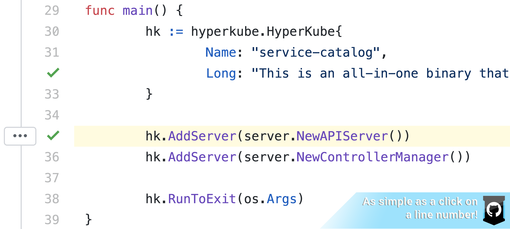
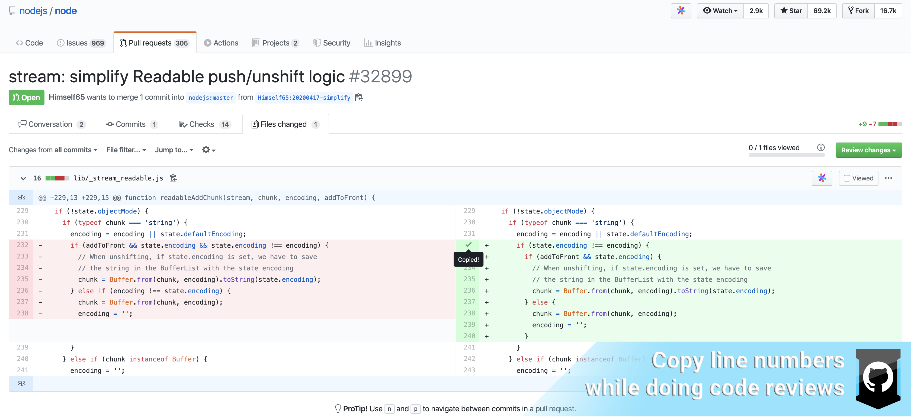
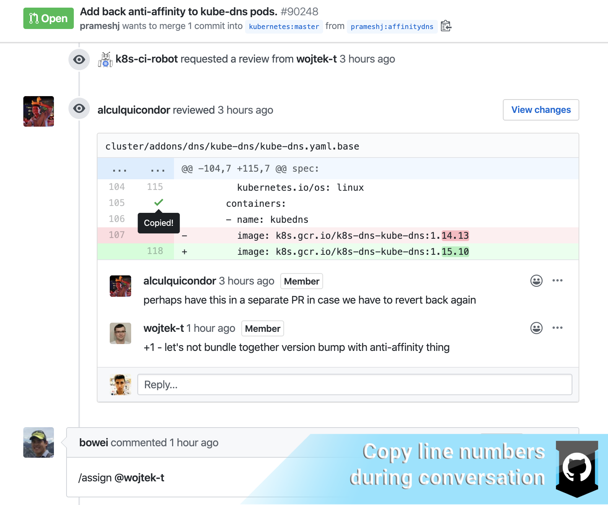
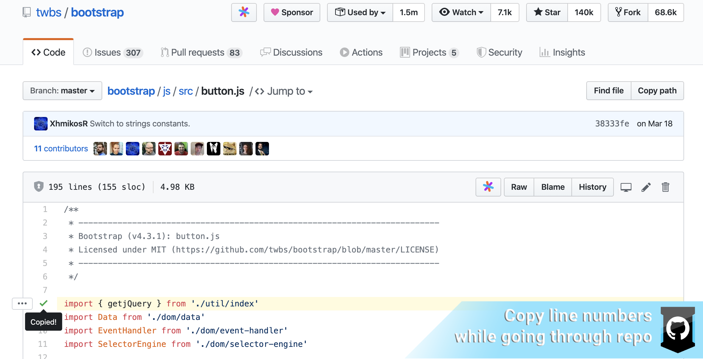

<h1>
   Line Clipper
  
  
  
</h1>

**LineClipper** is a Chrome Extension which aims to optimize a software developer's
flow between the browser and the IDE when executing file retrieval.
This particular extension works on the GitHub source control platform.

## Motivation

A lot of IDEs provide quick find capabilities where you can specify a file path
and the IDE would open that file for you. Furthermore, you can also specify a line number
of said file at which you'd like to go to. Example:

`api/controllers/base_controller.go:73`

The following would take us to the `base_controller.go` file on line 73 in the *api/controllers* directory.

When working with GitHub and especially when making code reviews it's common for a developer
to jump from the browser to the IDE and vice versa. Often the developer would look at a file
and would want to quickly find and open that file at a particular point (line). To achieve this
today the individual would have to go over the following steps:

1. Copy file path by selecting the copy button at the top of the file (in some perspectives there isn't even any copy button and you have to select and copy the path manually)
2. Move his attention back to the critical piece of code and remember the line number of interest
3. Go to the IDE and trigger quick find
4. Paste the file path that was copied
5. Remember to also append and write the line number of interest
6. Execute search

## Solution

This extension tries to optimize this flow by providing simplistic functionality which copies both the
file path and also appends the corresponding line number to it. All an individual has to do is click
on the line number of interest. In this way we optimize the above flow not only in steps, but also in
mental effort. You can now focus on what you want to do and not worry about petty details which break flow:

1. Copy line number by clicking the number of the line in the file of interest
2. Go to the IDE and trigger quick find
3. Paste the file path that was copied (it includes the appended line number)
4. Execute search

## Features:

The extension focuses on doing one thing and do it well - copy file paths with their respective line numbers to your clipboard when clicking on specific line numbers while viewing any
type of file with line numbering on GitHub.

#### Simplistic - just click on the desired line number:

#### While doing code review:

#### During conversation:

#### When going through repository files:

## Installation

### Install extension from official extension stores

⭐️ Chrome users can download the extension from the Chrome Web Store [HERE](https://chrome.google.com/webstore/detail/line-clipper-for-github/kecjnmjgliaihgbllmidpbbgnhgfobnn). ⭐️

🦊 Firefox users can download the extension from the Mozilla's official Add-ons page [HERE](https://addons.mozilla.org/en-US/firefox/addon/line-clipper-for-github). 🦊

🌐 Microsoft Edge users can download the extension from the Chrome Web Store [HERE](https://chrome.google.com/webstore/detail/line-clipper-for-github/kecjnmjgliaihgbllmidpbbgnhgfobnn). 🌐

> Microsoft Edge has the unique capability of allowing installation of extensions from the Chrome Web Store - this is how you can make use of this extension. If you have questions or concerns regarding installation of this extension from the Chrome Web Store on your Microsoft Edge browser, please check [this page](https://support.microsoft.com/en-us/help/4027935/microsoft-edge-add-or-remove-browser-extensions).

Your feedback is **valuable** so it would be appreciated if you leave a rating or feedback from your experience!

### Install the extension manually on your local machine

Download a [release](https://github.com/NickyMateev/Line-Clipper/releases) of your choice and unzip it **OR** clone this repository.

#### Google Chrome

1. Navigate to *chrome://extensions* in your browser. You can also access this page by clicking on the Chrome menu on the top right side of your browser, hovering over **More Tools** and then selecting **Extensions**.
2. Check the box next to **Developer Mode**.
3. Click **Load Unpacked Extension** and select the directory where you downloaded and unpacked the extension.

#### Mozilla Firefox

1. Navigate to *about:addons* in your browser. You can also access this page by clicking on the Firefox menu on the top right side of your browser and then selecting **Add-ons**.
2. Click on the Gear icon on the top right -> **Debug Add-ons**.
3. Click on **Load Temporary Add-on**.
4. Select `traverser.js` from the directory where you downloaded and unpacked the extension.

> Firefox requires loading temporary extensions every time you restart the browser. More information regarding temporary extensions you can find [HERE](https://extensionworkshop.com/documentation/develop/temporary-installation-in-firefox).

#### Microsoft Edge

1. Navigate to *edge://extensions* in your browser. You can also access this page by clicking on the Microsoft Edge menu on the top right side of your browser and then selecting **Extensions**.
2. Enable **Developer Mode** on the bottom left side of the page.
3. Click **Load Unpacked Extension** and select the directory where you downloaded and unpacked the extension.

**Congratulations!** You can now use and play around with the extension and its source.

## Contribution

📝 Feel free to propose changes or open issues when you have ideas for improvement.

## FAQ

Q: *Why does the extension state upon installation that it can read and change all my data on the websites I visit?*

A: **LineClipper** will only try to work on websites which contain *github* as part of their domain. You check out
this in source [here](https://github.com/NickyMateev/Line-Clipper/blob/3f13ab4063e2f72e9860e974d3ec58ee1dda0306/manifest.json#L8).
The reason for deciding to work on all domains containing *github* is that often developers work with multiple
public/private installations of GitHub. Out of convenience for the developer it was decided to simply match these domains
automatically instead of having to make the developer whitelist every single GitHub domain he works in.

Q: *Does this work only when traversing a GitHub project's file tree and looking at different files?*

A: No, it works for **every page** on GitHub which has a file with lines in it. You can copy lines from
the GitHub Pull request diff perspective when you're looking at the file diffs or at the main page of a
pull request where sometimes we see some code snippets which have been commented. You can also copy line numbers
when you're going through old commits and looking around at the files.

Q: *Does it work for all GitHub installations or just the public *https://github.com* installation?*

A: The extension works on all kinds of GitHub installations public/private as long as the domain contains
the word *github* in it.

## Notice

**LineClipper** (also known as **Line Clipper for GitHub** in the Chrome Web Store/Mozilla's Add-ons site) is not endorsed by GitHub.

**GitHub**, **Google Chrome**, **Mozilla Firefox** and **Microsoft Edge** are trademarks of their respective owners.
